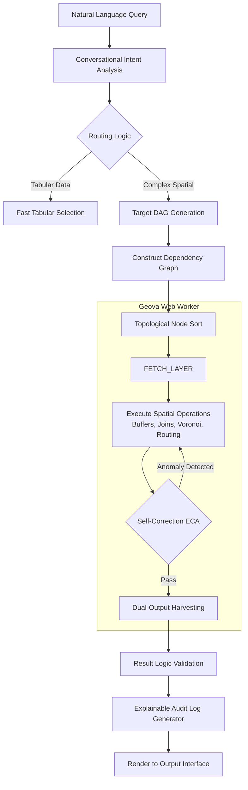

# Geova AI Engine Architecture

Geova AI represents a paradigm shift in geospatial intelligence. By coupling state-of-the-art Natural Language Processing with an advanced Spatial DAG (Directed Acyclic Graph) compute engine, Geova translates human intent into complex spatial analytics—all executed instantly from your browser.

## Key Architectural Pillars

1. **Absolute Data Privacy**: The spatial engine runs 100% within the browser's Web Worker context utilizing Turf.js algorithms and WebAssembly acceleration. No proprietary geometries or sensitive company data ever leave your device to be processed on a remote server.
2. **Blazing-Fast Client-side Execution**: By leveraging an R-Tree indexed memory cache and progressive DOM virtualization, heavy spatial operations scale beautifully and execute with negligible latency.
3. **Self-Healing Execution**: Built-in ECA (Event-Condition-Action) triggers allow the AI to proactively detect execution anomalies, auto-correct spatial projections (CRS mismatches), and recalculate failed analysis paths autonomously.

---

## Core System Components

Geova AI securely passes instructions across four highly specialized micro-orchestrators:

- **AI Orchestrator**: The semantic brain. Responsible for conversational intent detection, multi-step query extraction, and mapping your plain English against strict spatial schema rules.
- **DAG Compute Engine**: The heavy lifter. A Web Worker compatible grid running 40+ top-tier spatial operations (e.g., Areal Interpolation, K-Means Clustering, Gap Analysis) in an isolated, high-performance thread.
- **DAG Result Validator**: The quality assurance gateway. Before returning data, it scans for zero-result anomalies, "Null Island" coordinate errors, and logic plausibility, ensuring enterprise reliability.
- **Geova Agent**: The overarching intelligence logic tracking your workflow session and choosing whether to execute basic tabular filters or robust spatial simulations.

---

## The DAG Execution Flow

When a user requests a robust geographic computation, the system dynamically compiles and evaluates a dependency graph to sequence operations efficiently.

